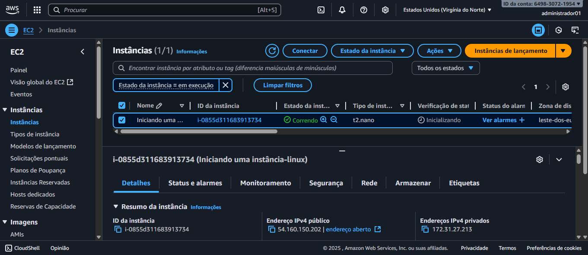

# Desafio de Gerenciamento de Instâncias EC2 na AWS

**Autor:** Laydianne Costa

**Projeto:** Conclusão do desafio de laboratório da Formação AWS Cloud Foundations, com foco em Gerenciamento de Instâncias EC2.

---

## 1. Introdução: O Que é EC2?

O Amazon Elastic Compute Cloud (EC2) é um serviço da AWS que nos fornece a capacidade de computação na nuvem, atuando como máquinas virtuais com sistemas operacionais Windows ou Linux.

Uma instância EC2 é composta por diversos recursos, como:

- **CPU**
- **Memória**
- **Disco**
- **Rede**
- **Sistema Operacional**

No modelo de nuvem, o EC2 é um exemplo de **Infraestrutura como Serviço (IaaS)**. Isso significa que, ao usar esse serviço, nossa responsabilidade se concentra em gerenciar os aplicativos, dados e as conexões que estabelecemos com a instância.

---

## 2. Passo a Passo do Projeto

### 2.1. Criação e Execução da Instância

O primeiro passo foi provisionar uma instância EC2. A tela abaixo confirma que a instância foi criada com sucesso e está em estado de execução (`running`).

A escolha da instância correta é crucial para garantir a eficiência e a economia. Para este projeto, foi utilizada uma instância do tipo `t2.nano`, adequada para tarefas de desenvolvimento e testes.

### 2.2. Configuração de Segurança (Grupo de Segurança)

Para proteger a instância, utilizei um **Grupo de Segurança**, que funciona como um firewall embutido na AWS. Ele permite controlar o tráfego de rede para a instância.

A imagem a seguir mostra as regras de entrada (`Inbound Rules`) que configurei, permitindo o acesso via SSH (porta 22), que é essencial para o gerenciamento remoto da máquina.

### 2.3. Otimização de Custos

Um dos princípios fundamentais da nuvem é a otimização de recursos, que está diretamente ligada à economia de custos[cite: 2]. Desligar recursos não utilizados em ambientes de desenvolvimento, teste ou treinamento é uma das principais formas de poupar gastos, já que a cobrança é baseada no tempo de execução[cite: 2].

Como demonstrado abaixo, a instância foi parada (`stopping`). Ao parar a instância, os recursos de CPU, memória e rede são desativados, e a cobrança é suspensa.grupo-de-seguranca

---

Outra abordagem que podemos acrescentar é:

## 3. Armazenamento na Nuvem com EC2

### 3.1. Amazon EBS (Elastic Block Store)

Amazon EBS é uma storage altamente confiável que pode ser anexada a qualquer instância EC2. Toda instância possui um volume de armazenamento, mas com o EBS conseguimos ter a capacidade de expansão de forma rápida, com apenas alguns cliques.

Com o EBS, podemos criar uma nova partição em nossa instância, funcionando como se estivéssemos anexando um "HD externo". Escolhemos o modelo e o tamanho e anexamos à nossa VM.

Exemplos de uso para Amazon EBS:

- Armazenamento para bancos de dados, como MySQL, PostgreSQL e Oracle.
- Armazenar dados para aplicativos web e logs de sistema.

### 3.2. Amazon S3 (Simple Storage Service)

Amazon S3 é um serviço de armazenamento de objetos em nuvem oferecido pela AWS. É ideal para armazenar, organizar e recuperar grandes volumes de dados de forma segura e escalável. O S3 possui classes de armazenamento que permitem economizar nos custos. É possível utilizar regras de ciclo de vida (Lifecycle) para definir como o Amazon S3 gerencia os objetos, permitindo a transição automática de objetos para classes como Glacier ao longo do tempo.

---

## 4. Otimização de Recursos na AWS (Foco em EC2)

A otimização de recursos na AWS está diretamente ligada à redução de custos. Mesmo ao melhorar o desempenho de um sistema, estamos poupando custos, pois isso traz ganho para a nossa solução na nuvem.

### 4.1. Estratégias de Otimização de Recursos

**Desligando Instâncias Não Utilizadas:** Em ambientes de desenvolvimento, testes ou treinamento que não são utilizados durante a noite ou nos fins de semana, as instâncias podem ser desligadas, resultando em menor utilização e poupança.

**Remover Recursos Ociosos ou Não Utilizados:** Criar recursos e não verificar sua utilização pode levar a ter vários recursos ociosos no ambiente, gerando gastos desnecessários. Isso é comparado a alugar um carro e deixá-lo na garagem.

**Escalar Recursos:** Executamos o "scale" de recursos para processar "workloads" em determinados momentos. Temos a opção de aumentar ou diminuir de forma manual ou automática.

- **Escalonamento Verticalmente:** Significa acrescentar ou reduzir capacidade de um recurso em um mesmo nó. Geralmente está relacionado a alterar o número de vCPUs, memória, storage, rede de uma instância.
- **Escalonamento Horizontalmente:** É quando você aumenta o número de recursos. Por exemplo, adicionando mais um disco rígido ou adicionando mais uma instância para suportar a aplicação.

### 4.2. Opções de Compra de Instâncias EC2 para Otimização de Custos

A AWS oferece diferentes modelos de compra para instâncias EC2, cada um com suas características e benefícios de custo:

**1. Sob Demanda (On-Demand):**

- Instâncias compradas a uma taxa fixa por hora.
- Recomendadas para aplicativos com cargas de trabalho irregulares de curto prazo que não podem ser interrompidas.
- Adequadas para uso durante o teste e desenvolvimento de aplicativos no EC2.

**2. Instâncias Reservadas (Reserved Instances):**

- Costumam ser mais baratas que as instâncias sob demanda.
- A desvantagem é a necessidade de pagar o ano inteiro de uso, o que pode ser uma desvantagem para quem não precisa usar a instância com frequência.

**3. Instâncias SPOT:**

- Garantem a disponibilidade das aplicações sob demanda com descontos de até 90%.
- A principal desvantagem é que podem ser encerradas pela Amazon Web Service (AWS) a qualquer momento, com um aviso de dois minutos.

---

## 5. Conclusão e Aprendizados

Este desafio me permitiu aplicar, na prática, os conceitos teóricos sobre EC2 e gerenciamento de nuvem. Através deste exercício, pude entender a importância de:

- Escolher o tipo de instância correto para a workload.
- Configurar regras de segurança para proteger o ambiente.
- Otimizar recursos para evitar custos desnecessários.

Este projeto no GitHub serve como um portfólio técnico e um material de apoio para revisões futuras.
